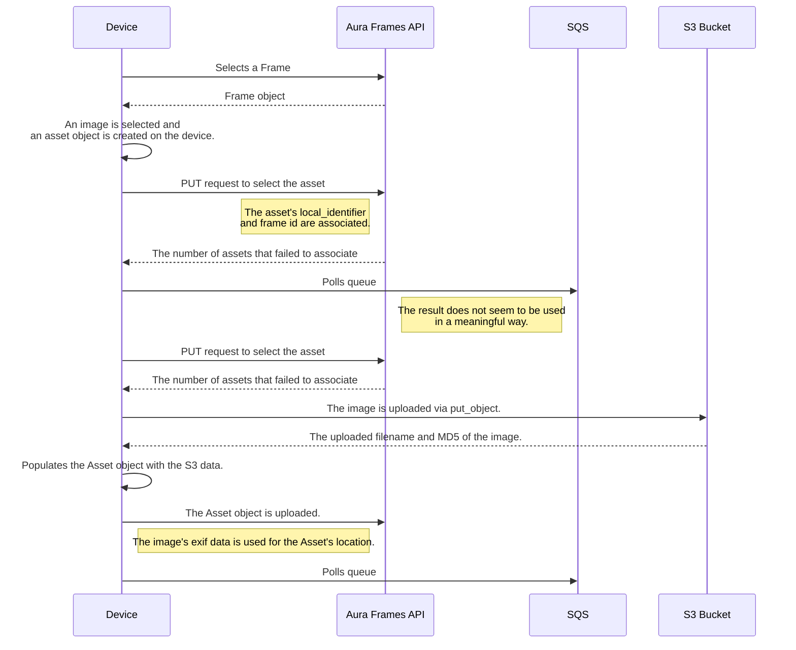

# Aura Frames (PUSHD) Python Client [unofficial]

[](https://github.com/coredmp95/pushframe/actions/workflows/tests.yml)
[](LICENSE)
[](https://www.python.org/downloads/)

**The unofficial Aura Frames CLI whose flagship feature mirrors a Google Photos
album onto your frame — automatically, reversibly, on a schedule.** Under the
hood it implements most of the AuraFrames APIs in Python (read **and** write
path). See the [highlight section](#highlight-mirror-a-google-photos-album-onto-your-frame).

Any advice or issues are welcome.

> **Provenance:** this project is a renamed, heavily extended fork of
> [zmanowar/auraframes](https://github.com/zmanowar/auraframes) — the original
> 2023 reverse-engineering of the Aura/Pushd API is his work (see
> [Credits](#credits) and [LICENSE](LICENSE)). Unofficial community tool:
> **not affiliated with or endorsed by Aura Frames Inc.**

> **Read path: VERIFIED end-to-end** against `api.pushd.com/v5` (login → list → fetch →
> download). See [`VERIFICATION-REPORT.md`](VERIFICATION-REPORT.md) for the per-step status
> and the live API drift repaired.
>
> **Write path: VERIFIED end-to-end** against a live frame — upload, hide, re-show, remove,
> and irreversible delete have each been exercised through the CLI, including the
> confirmation gates. See [`docs/CLI.md`](docs/CLI.md) for the commands and the known issues.
>
> **Google Photos mirror: VERIFIED end-to-end** — `google-link` → `google-album` →
> `google-sync --apply` on a live 95-photo album: a real apply uploaded the 74 missing
> photos and hid the 2 removed ones in 1:26, and a steady-state run plans from listings
> alone and transfers nothing. See the
> [highlight section](#highlight-mirror-a-google-photos-album-onto-your-frame).
>
> The **device** upload/download flows described near the end of this README remain
> **documented from code, not verified** — they describe what the official app does, not a
> path this client exercises.

## Highlight: mirror a Google Photos album onto your frame

> **This is the killer feature.** Point `pushframe` at a Google Photos album
> (shared albums included) and a frame: every run makes the frame **match the
> album**. One-time browser login, then plain authenticated HTTP — set it up
> once, schedule it nightly, and the frame follows the album forever.
> **Live-verified end-to-end**: a real apply on a 95-photo album uploaded the
> 74 missing photos and hid the 2 removed ones in 1:26, and a steady-state run
> plans from listings alone and transfers nothing.

**The principle — a one-way mirror, album → frame.** Each run lists the album
and the frame, diffs them **by md5 content hash**, then:

1. **downloads once and uploads** what is missing — into a staging cache that
   is pruned once the uploads confirm; what persists is a small manifest
   mapping each Google photo id to its md5;
2. **hides** what left the album — it stops displaying on the frame but stays
   in the account, and re-adding it to the album re-shows it **without
   re-uploading a byte**;
3. **re-shows** what came back — photos already on the frame (under any name,
   even uploaded from elsewhere) are **recognized, never re-uploaded**.

Because the manifest persists, a steady-state run costs one album listing and
one frame listing — **zero downloads, zero uploads**, and its `--apply` is
effectively free.

**Safety rails (SAFE-01..04):** an empty or truncated album listing aborts
instead of planning a mass-hide (SAFE-01); a plan hiding more than 20 % of the
frame's photos demands an explicit confirmation (SAFE-02); **this verb never
deletes** — removal is hide-only, and the irreversible tiers stay with `sync`
alone (SAFE-03); a failed download is retried next run and never uploaded as
junk bytes (SAFE-04). Every frame write is paced by the client-side
[write budget](#write-path-upload--status--anti-abuse-budget), and scheduled
runs skip rather than fail on a mass-hide.

**How to set it up — three commands:**

```bash
# 1. One-time: a browser window opens on a dedicated profile; log into
#    Google, it auto-detects the completed login (re-linking is the
#    same command).
uv run pushframe google-link

# 2. Pick the album and preview the plan (writes nothing):
uv run pushframe google-album --list
uv run pushframe google-sync "Cadre" --frame "Cadre de Fabrice"

# 3. Apply (one y/N confirmation) — re-run whenever, or schedule it:
uv run pushframe google-sync "Cadre" --frame "Cadre de Fabrice" --apply
```

**Make it automatic:** name the album↔frame mapping once, then let a systemd
USER timer mirror it every night — headless, prompt-free, per-pair state:

```bash
uv run pushframe config pair add cadre --album Cadre --frame "Cadre de Fabrice"
uv run pushframe schedule add nightly --pair cadre --every 1d
```

Only the one-time `google-link` needs a visible browser (on a server, connect
with `ssh -X`); everything after that — `google-sync`, `schedule` — is
headless by nature.

→ Full details and real outputs:
[`google-link` / `google-album`](#google-photos-albums--google-link--google-album) ·
[`google-sync` mirror semantics](#google-sync--mirror-a-google-album-onto-a-frame) ·
[pairs](docs/CLI.md#pairs--one-album--several-frames-and-back) ·
[scheduling](docs/CLI.md#scheduling--systemd-user-timers-no-root)

## Requirements

- Python 3.14 (pinned via `.python-version`) and [`uv`](https://docs.astral.sh/uv/) for
  environment, dependency, and interpreter management.
- A live Aura account (email + password) for any command that actually hits the API.

Release history lives in [CHANGELOG.md](CHANGELOG.md) (Added / Changed /
Deprecated / Fixed / Security per release, Keep a Changelog format).

## Install (Ubuntu/Debian)

Pre-built `.deb` packages embed their own Python 3.14 runtime under
`/usr/lib/pushframe/` — **no system Python is used or modified**, and the
package needs only `ca-certificates` and `libc6`. Removal is clean (the
package owns every file it ships, including bytecode; nothing is written
into the system tree at run time).

```bash
# from a release artifact:
sudo apt install ./pushframe_<version>_amd64.deb
```

### uv tool (or pip) — any Linux distro, per-user

The PyPI package is pure Python and self-contained — no system Python is
touched either; `uv` manages an isolated environment for the tool:

```bash
uv tool install pushframe      # or: pipx install pushframe
pushframe --version
```

**Which path when?** deb/APT = system-wide install on Ubuntu/Debian
servers (root-owned, autoremove-friendly). `uv tool install` = per-user,
no sudo, any distro with uv (or pipx) installed. Same CLI, same config
(`~/.config/pushframe/`), same version story: every channel ships the
same release, and `pushframe --version` tells you what runs.

### APT repository

A signed APT repository is served from this project's GitHub Pages. Three
commands, exactly as verified in a clean container:

```bash
# 0. the apt keyring dir (already present on recent systems)
sudo install -d -m 0755 /etc/apt/keyrings

# 1. trust the repository key
#    (dedicated signing key, fingerprint
#     0EE2DB2DB1360C58C4B2E0BF2EC06828F722F391)
curl -fsSL https://coredmp95.github.io/pushframe/dists/pushframe.asc \
  | sudo gpg --dearmor -o /etc/apt/keyrings/pushframe.gpg

# 2. add the sources entry (arch=amd64: the repo is amd64-only — on
#    multi-arch machines this silences apt's i386 notice)
echo "deb [arch=amd64 signed-by=/etc/apt/keyrings/pushframe.gpg] https://coredmp95.github.io/pushframe stable main" \
  | sudo tee /etc/apt/sources.list.d/pushframe.list

# 3. install
sudo apt update && sudo apt install pushframe
```

`apt update` must stay free of signature warnings — if it is not, compare the
key fingerprint above with `gpg --show-keys /etc/apt/keyrings/pushframe.gpg`.
The repository and the `.deb` are produced by `scripts/publish-apt-repo.sh`
and `scripts/build-deb.sh`; the signature chain (InRelease/Release.gpg) is
verified end-to-end by `scripts/test-apt-journey-container.sh`.

## Setup & Run (uv, from source)

This project uses `uv` exclusively (no `pip` / `venv` / `poetry`). From a clean checkout:

```bash
# 1. Install runtime dependencies (creates .venv, respects uv.lock + .python-version).
#    uv auto-installs the pinned Python 3.14 interpreter on first sync if needed.
uv sync

# 2. Run the read-path demo (login -> list frames -> fetch assets -> download one image).
#    With PUSHFRAME_EMAIL / PUSHFRAME_PASSWORD unset it prints a helpful message and exits cleanly.
uv run python main.py
```

To run the asserted live read-path proof, you need the **`dev` extra** (pytest +
python-dotenv live there and are **not** installed by `uv sync` alone):

```bash
# Install the dev extra, then run the 4 live read-path tests (needs real credentials):
uv sync --extra dev
uv run pytest -m live
# — or, in one shot without a separate sync step:
uv run --extra dev pytest -m live

# The credential-less default suite stays green (live tests deselected):
uv run pytest -m "not live"
```

> Documenting a bare `uv run pytest -m live` **without** `--extra dev` (or a prior
> `uv sync --extra dev`) will fail on a clean checkout — `pytest` is an opt-in extra.

## Configuration

The easy path is the wizard — it asks once, verifies the login against the real API
before writing anything, and stores the result in `~/.config/pushframe/config.json`
(mode `0600`):

```bash
pushframe config          # interactive wizard: email → password (hidden) → live login test
pushframe config show     # every setting: effective value (secrets ***), and where it comes from
pushframe config import .env   # adopt an existing .env without retyping it
pushframe config set KEY VALUE / get KEY / path
```

Every value resolves at use time with the precedence **environment variable → config
file → built-in default**. Environment variables keep working exactly as before (all
names below); `config show` warns when an env var shadows what you put in the file.
Credentials never touch the config file unless you put them there (or run the wizard,
which stores only the email plus the session token — never the password).

<details>
<summary>Environment variables (override the config file)</summary>

**Required:**
- `PUSHFRAME_EMAIL`: The email of the account to authenticate with.
  - `Aura.login` may optionally be called with an email and password instead of setting env vars.
- `PUSHFRAME_PASSWORD`: The password of the account to authenticate with.

**Optional (with defaults):**
- `PUSHFRAME_LOCALE`: The locale of the device to mimic. (Default: `en-US`)
- `PUSHFRAME_APP_IDENTIFIER`: The identifier of the aura app. (Default: `com.pushd.client`)
  - This may change between iOS and Android app implementations, untested.
- `PUSHFRAME_DEVICE_IDENTIFIER`: The unique identifier of the device to mimic. (Default: `0000000000000000`)
  - Ideally this should be set to your unique identifier, though it accepts others.

**Optional — write budget & geo guard** (used by `sync --apply`, `push`, and `google-sync --apply`; see
[*Write Path*](#write-path-upload--status--anti-abuse-budget) below):
- `PUSHFRAME_COUNTRY`: Expected account country for the geo pre-flight check, e.g. `FR`.
  **Unset disables the check entirely.**
- `PUSHFRAME_GEO_FAIL_OPEN`: Continue if the country lookup itself fails. (Default: `true`)
- `PUSHFRAME_WRITE_BUDGET_CAPACITY`: Token-bucket capacity, in requests. (Default: `30`)
- `PUSHFRAME_WRITE_BUDGET_REFILL_PER_MIN`: Refill rate per minute. (Default: `0.75`)
- `PUSHFRAME_WRITE_BUDGET_WAIT`: Wait for a refill rather than stopping. (Default: `true`)
- `PUSHFRAME_WRITE_BUDGET_MAX_WAIT`: Max seconds to wait. (Default: `3600`)
- `PUSHFRAME_STATE_DIR`: Where the persisted budget lives. (Default: `~/.config/pushframe`)

**Optional — Google sync:**
- `PUSHFRAME_PROBE_CHROME_PROFILE`: Overrides the dedicated Chrome profile directory `google-link`
  uses for the one-time cookie harvest (default `~/.config/pushframe/chrome-profile`, created
  on demand).
- `PUSHFRAME_GOOGLE_SYNC_REMOVAL_THRESHOLD`: Fraction of the frame's photos above which
  `google-sync` demands explicit confirmation before hiding (Default: `0.2`).

Boolean variables accept `1`, `true`, `yes`, `on` (case-insensitive); anything else is false.

> **Legacy names:** the old `AURA_*` spellings (`AURA_EMAIL`, `AURA_STATE_DIR`,
> `AURA_WRITE_BUDGET_*`, `AURA_PROBE_CHROME_PROFILE`, …) are still read as
> fallbacks — one release of grace. The old config directory
> `~/.config/auraframes/` is migrated automatically to `~/.config/pushframe/`
> on the first run (the old directory is left untouched).
</details>

## CLI Usage (`pushframe`)

A CLI wraps the library (installed as the `pushframe` entry point by `uv sync`). There are
twelve commands — the Google trio is the flagship flow (see the
[highlight](#highlight-mirror-a-google-photos-album-onto-your-frame) above):

| Command | What it does | Writes? |
|---------|--------------|---------|
| `google-link` | Link (or re-link) your Google Photos account — one-time browser harvest | Vault write only (outside the repo) |
| `google-album` | Select a Google Photos album and enumerate it exactly | No (read-only) |
| `google-sync` | **Mirror a Google Photos album onto a frame** (dry run by default) | Yes, with `--apply` |
| `schedule` | Install/list/remove systemd USER timers that run pairs unattended | systemd units |
| `config` | Store credentials, pairs and settings once (wizard, `0600`) | Config file only |
| `status` | Check credentials, log in, list your frames, show the Google link state | No |
| `logout` | Delete the stored session token — email and settings stay | Config only |
| `doctor` | One deliberate write probe: can THIS machine write TODAY? | One 4×4 test image |
| `inspect` | Show one frame's photos and metadata | No |
| `sync` | Make a frame **match** a local directory | Yes, with `--apply` |
| `push` | Upload from a supply directory — **never** removes | Yes, with `--apply` |
| `reconcile` | Report (and optionally remove) stuck placeholder rows on a frame | Only with `--apply` |

**→ Full reference with every flag, real output, and known issues: [`docs/CLI.md`](docs/CLI.md)**

### Start here

```bash
# Health check: are credentials set, does login work, which frames exist?
uv run pushframe status
```

```
PUSHFRAME_EMAIL: set
PUSHFRAME_PASSWORD: set
Logged in as you@example.com
1 frames:
  - Living Room (id: 00000000-0000-0000-0000-000000000000)
```

`--frame` takes a **case-insensitive substring of the frame name**, or an exact id. An
ambiguous substring stops the run and lists the matches rather than guessing:

```bash
uv run pushframe inspect --frame "living"
```

### `sync` — match a directory (dry run by default)

Nothing changes without `--apply`:

```bash
uv run pushframe sync ./photos/ --frame "Living Room"
```

```
Sync plan for Living Room (id: 00000000-...) — DRY RUN, nothing will be changed
To upload: 12
To hide: 3
To re-show: 1
Unchanged: 84
Already hidden: 2 (no action needed)
```

Photos are matched by **md5 content hash**, not filename — renaming a file locally does not
cause a re-upload.

```bash
# Apply it. One confirmation covers the whole plan and echoes the frame name + id.
uv run pushframe sync ./photos/ --frame "Living Room" --apply

# Non-interactive (CI, scripts) — --yes is required, otherwise it fails closed.
uv run pushframe sync ./photos/ --frame "Living Room" --apply --yes
```

### Removed photos are hidden, not deleted

A photo that leaves your directory is **hidden** by default: it stops displaying but stays in
your account, and comes straight back if you restore the file. The frame has no photo-count
limit, so preservation is the safe default — a mistaken sync should cost visibility, never
photos.

```bash
# Default: hide. Reversible.
uv run pushframe sync ./photos/ --frame "Living Room" --apply --yes

# Remove from this frame (the asset survives in your account).
uv run pushframe sync ./photos/ --frame "Living Room" --apply --yes --delete

# Destroy account-wide. IRREVERSIBLE.
uv run pushframe sync ./photos/ --frame "Living Room" --apply --hard-delete
```

| Flag | Effect | Reversible |
|------|--------|------------|
| *(none)* | Hidden — stops displaying, stays on the frame | **Yes** |
| `--delete` | Removed from this frame | Must re-upload |
| `--hard-delete` | Destroyed account-wide | **No** |

`--delete` and `--hard-delete` are mutually exclusive (argparse rejects both together).

`--hard-delete` does **not** accept a y/N answer. It makes you re-type the exact count, so you
have to read the number first:

```
To hard-delete: 12
IRREVERSIBLE: 12 photo(s) will be permanently destroyed account-wide, not just removed from
this frame. This cannot be undone.
To confirm, type the number of photos to hard-delete (12): y
Aborted.
```

Only `12` proceeds. Note that `--yes` skips this gate like any other, so
`sync --apply --yes --hard-delete` destroys without prompting — use it deliberately.

### Restoring a hidden photo

Because hiding is reversible and hidden photos still count as present for deduplication, the
round trip is just moving the file back:

```bash
mv ./photos/sunset.jpg /tmp/ && uv run pushframe sync ./photos/ --frame "Living Room" --apply --yes
# -> To hide: 1

mv /tmp/sunset.jpg ./photos/ && uv run pushframe sync ./photos/ --frame "Living Room" --apply --yes
# -> To re-show: 1   (and "To upload: 0" -- it is un-hidden, not uploaded again)
```

### `push` — upload only, never removes

`push` is structurally additive: its removal list is forced empty, so it cannot hide, remove,
or re-show anything. Use it when you want to *add* from a supply directory without the frame
being diffed to match it.

```bash
# Dry run, then apply. Photos already on the frame are skipped by md5.
uv run pushframe push ./buffet/ --frame "Living Room"
uv run pushframe push ./buffet/ --frame "Living Room" --apply --yes

# Pacing flags for the anti-abuse write budget (see below):
#   --limit N         upload at most N photos this run
#   --batch-size N    assets per select_asset/batch_update call (default 50)
#   --chunk-delay S   seconds to pause between write chunks (default 5)
uv run pushframe push ./buffet/ --frame "Living Room" --apply --yes --limit 40

# Budget / geo overrides:
#   --max-wait S      cap the wait for budget refill (default 3600)
#   --no-wait         stop instead of waiting when the budget is dry
#   --country XX      expected account country for the geo pre-flight guard
#   --ignore-budget   bypass the budget entirely (escape hatch)
```

**If you are unsure which to use, use `push`** — it cannot take anything away.

### Google Photos albums — `google-link` / `google-album`

These commands read your **Google Photos** shared albums (a separate account from the Aura
API) — together with `google-sync` below they form the flagship mirror flow, summarized in
the [highlight section](#highlight-mirror-a-google-photos-album-onto-your-frame). The
mechanism is the browser-automation one proven in phase 16: a dedicated-profile
browser harvests the session cookies once, and every later operation is plain authenticated
HTTP over the internal `batchexecute` API — no browser runs again.

**One-time setup:** `google-link` opens a **visible** Chrome window on a dedicated profile
(default `~/.config/pushframe/chrome-profile`, created on demand — your daily-driver profile
is structurally unreachable) and links the account:

```bash
uv run pushframe google-link
```

A browser window opens; log into Google inside it. The command auto-detects the completed
login, saves the session to `~/.config/pushframe/google-cookies.json` with `0600`
permissions outside the repository, and prints only identity signals — cookie **names**, a
count, never values. **Re-linking is the same command**: when a session expires (they do,
that cadence is an accepted operational cost), run `google-link` again.

Then select and enumerate an album by name, share link, or id:

```bash
# Discover the account's shared albums:
uv run pushframe google-album --list

# By name substring — ambiguity prints a numbered list and stops (exit 2):
uv run pushframe google-album "Corse"

# By share link or album id — used exactly as given:
uv run pushframe google-album "https://photos.google.com/share/AF1Qip...?key=..."
```

The resolved album is walked **completely** (the internal `snAcKc` continuation RPC,
300 items/page, until exhaustion — the count must match what the Google Photos UI shows)
and every item's exact byte size is measured with 1-byte `Range` requests, so the summary
prints the exact disk weight without downloading a single photo:

```
Album: Vacances Corse (id shape: photos.google.com/share/AF1Qip…0001)
Items: 24 (pages: 1, exhausted: cleanly)
Disk weight: 90,813,552 bytes = 86.6 MiB (min 512,331, max 8,120,444, avg 3,783,898)
Per-item (index | id shape | WxH | bytes):
     1 | AF1Qip…base1 | 4898x3265 | 3,412,350
     ...
```

**Privacy posture:** session cookies live only in the `0600` vault outside the repository
and are readable solely by the `pushframe.google` package (sync/CLI code paths are
structurally refused); album capability URLs are secrets-like and are always printed
redacted (`AF1Qip…<last4>`). `status` reports the Google link state — `linked: yes/no`,
the account email, session usability — and never a cookie value or token.

### `google-sync` — mirror a Google album onto a frame

One verb ties the Google side to the frame: enumerate the album, download what is missing,
upload it, and mirror removals as **hides**. (This is the flagship flow — see the
[highlight section](#highlight-mirror-a-google-photos-album-onto-your-frame) for the
principle; here is the full walkthrough.) Start to finish:

```bash
# One-time setup (or again whenever the Google session expires):
uv run pushframe google-link

# Find the album, then mirror it:
uv run pushframe google-album --list
uv run pushframe google-sync "Cadre" --frame "Cadre de Fabrice"           # dry-run plan (writes nothing)
uv run pushframe google-sync "Cadre" --frame "Cadre de Fabrice" --apply   # one y/N, then it mirrors

# Non-interactive (CI, scripts) — --yes is required for --apply, otherwise it fails closed:
uv run pushframe google-sync "Cadre" --frame "Cadre de Fabrice" --apply --yes
```

A real **production run** against the live pair `cadre-venus` (album « Cadre », 95 photos,
74 of them missing from the frame and 2 removed since the last sync):

```
Plan: 74 to upload, 0 to re-show, 21 unchanged, 2 to hide, 2 already hidden
Videos skipped: 0 (metadata delta — videos are out of sync scope, never silently dropped)
Upload candidates: 74 items …
```

```text
Applied: 74 uploaded, 2 hidden, 0 re-shown in 1:26   ·   cache pruned, 95 files, 0 failures
```

The md5 dedupe also works **across accounts**: a photo whose bytes are already on the frame
(uploaded from anywhere, under any name) is re-shown instead of re-uploaded. After an apply
the cache is pruned and the manifest persists — so a steady-state run costs one album listing
and one frame listing, and its `--apply` **downloads and uploads nothing**: the plan is all
`unchanged` / `already hidden`, with zero counts everywhere else.

#### Why the second run is free

Photos download once into a staging cache
(`~/.config/pushframe/google-cache/<album>/`), are uploaded with the same md5 convention
the frame uses, and the cache is **pruned** after the uploads confirm. What survives is a
persistent manifest (`~/.config/pushframe/google-manifest.json`, mode `0600`) mapping each
Google photo id to its md5. The plan is rebuilt from the **album listing + manifest**, never
from a walk of the pruned cache — that is what makes disk minimisation safe: "already synced"
and "removed from the album" stay distinguishable.

#### Mirror semantics

- **Remove a photo from the Google album**, re-run with `--apply`: it is **hidden** on the
  frame (`exclude_asset`) — it stops displaying but stays. Re-add it to the album and the
  next run re-shows it **without re-uploading a byte**. Both halves were proven live (see
  `18-UAT.md` in the planning tree).
- **Videos are skipped with a counted line** (the frame reports null md5 for videos, so
  content-hash diffing cannot see them) — never silently dropped.
- An **empty or truncated album listing aborts** with an error instead of producing a plan
  (SAFE-01) — a Google-side glitch can never read as "delete/hide everything".
- If a plan's removals exceed **20 % of the frame's photos**, an explicit confirmation
  echoes both counts first (SAFE-02; threshold overridable via
  `PUSHFRAME_GOOGLE_SYNC_REMOVAL_THRESHOLD`).
- **This verb never deletes.** Removal means hide; the gated `--delete`/`--hard-delete`
  tiers stay with `sync` only (SAFE-03).

#### Headless servers (google-link without a screen)

The one command that needs a visible browser is `google-link` (anti-bot
posture: Chrome runs visible, never headless). On a server, connect with
X11 forwarding — `ssh -X user@host` (needs `X11Forwarding yes` and
`xauth` on the server) — then run `pushframe google-link`: Chrome opens
on YOUR screen while executing on the server. The 0600 cookie vault it
writes survives logout, and every other command (`google-sync`,
`schedule`) is headless by nature — the display is needed once, at
link time.
- A failed or partial download is reported as failed and retried next run — never uploaded
  as junk bytes (SAFE-04).
- Google-side downloads run concurrently (bounded pool); every frame write stays sequential
  and paced by the [write budget](#write-path-upload--status--anti-abuse-budget).

### Exit codes and logging

`0` on success (a dry run and an aborted confirmation both count as success); `1` on missing
credentials, login failure, an unresolvable `--frame`, any per-item failure, a rate-limit
abort, a geo mismatch, or an exhausted budget.

Add `--debug` **before** the subcommand for verbose request/response logging on stderr
(`pushframe --debug status`, not `pushframe status --debug`). Every run also writes a full log
to `logs/file_{timestamp}.log`.

### Known issue: writes sometimes 401 on the first try

Roughly 4 in 10 live write runs have been seen failing with `401 Unauthorized` and succeeding
on an immediate re-run, with no change to credentials or network. There is **no automatic
retry yet** — if an apply reports 401 failures, just run it again. Repeating is safe: uploads
dedupe by md5 and hides are idempotent. See [`docs/CLI.md`](docs/CLI.md#known-issues) for the
other known quirks (asset-count mismatch, undeletable placeholder rows).

## Write Path (upload) — status & anti-abuse budget

> **Live-verified (v2.0).** Upload, hide, re-show, remove and hard-delete have each been run
> end-to-end against a real frame. The caveats below are about *volume and reliability*, not
> about whether the path works.

Key findings (from live runs + decompiling the official Android app):

- **Writes intermittently return a bare `401` and succeed on retry** — roughly 4 in 10
  observed runs, independent of endpoint, credentials, or exit-IP country. The client has no
  automatic retry yet, so a failed apply should simply be re-run. This is distinct from the
  budget trip below: it clears immediately rather than after a cooldown.
- **A write `401` is therefore not proof of a lockout.** Retry with a fresh login first, then
  check the geo guard, then suspect the budget.

- `select_asset` and `batch_update` are **native batch endpoints** — the client now sends a
  whole chunk of assets per call (`WRITE_BATCH_SIZE`, default 50) instead of one call per
  file, collapsing ~3N Pushd write calls to ~2 per chunk.
- The account has a rolling **write-volume budget** over a time window (≈50 new assets
  observed before a trip). Exceeding it returns a bare `401`/custom `475` (no `Retry-After`),
  which the client detects as a run of consecutive failures and **aborts loudly** rather than
  hammering. The official app never trips this because it drip-feeds uploads via a background
  `JobScheduler` queue over time (gated on charging + WiFi), retrying failures across runs.
- Consequence for bulk imports: use `push --limit` in **small waves spaced over time** rather
  than one big burst. `sync`/`push` are resumable — the md5 diff means re-running only
  attempts what is still missing. A large first-time import has still not been driven to
  completion in one sitting.
- A client-side **token-bucket budget and geo pre-flight guard** now run before every write
  (see the `PUSHFRAME_WRITE_BUDGET_*` / `PUSHFRAME_COUNTRY` variables above), so the server-side
  lockout is hard to reach by accident.

## iOS/Android Device's Upload Image Flow

> **Documented from code, NOT verified in this revive milestone.** The flow below is
> transcribed from the 2023-era implementation and has not been exercised against the live
> API during the read-path revive. Treat it as a reference, not a proven path. NOTE: the
> current CLI write path **batches** steps 4–9 across many assets per call (see *Write Path*
> above); the per-asset sequence below is the original single-asset reference.

[Aura.upload_image](pushframe/aura.py#L101) attempts to implement this flow as closely as possible.
1. A frame is selected and the frame's data is retrieved from the API (`/frames/<frame_id>.json`).
2. An image on the device is selected for upload.
3. An Asset object is created for the image and a GUID (`local_identifier`) is generated.
4. A POST request is made (`/frames/<frame_id>/select_asset.json`) with the asset's `local_identifier`.
   - This allows the asset to be related to a specific frame once the image has been uploaded.
5. SQS is polled (may not be necessary)
   - The result does not seem to be used in a meaningful way.
6. Another `select_asset.json` request is sent with the same information.
7. A `put_object` request is made to the S3 bucket `images.senseapp.co` with the image, the MD5 and uploaded filename are retrieved.
8. The asset object is populated with the S3 response.
9. A PUT request is sent to `/assets/batch_update.json` with the asset information.
    - I believe this is when the location exif data is read from the image file itself and used to populate future asset requests. Manually populating the exif data on the Asset object before sending it does not get returned in future requests.
    - The height and width of the image can be spoofed in the Asset object to produce skewed images, it seems like only the location exif is used.
10. SQS is polled again



## iOS/Android Device's Download/View Image Flow

> **VERIFIED end-to-end this milestone** (READ-01..READ-04) — see
> [`VERIFICATION-REPORT.md`](VERIFICATION-REPORT.md). `main.py` drives exactly this path.

1. A frame is selected and the frame's data is retrieved from the API (`/frames/<frame_id>.json`).
2. A paginated list of assets is retrieved with the `frame_id` (`/frames/{frame_id}/assets.json`).
3. A URL is built that contains the image proxy URL, the asset's uploaded user id, and the asset's S3 filename.
   - See [export.py](pushframe/export.py)
4. The image is retrieved from the URL.
5. TODO: Describe rendering

### TODOs

> These are open reverse-engineering notes — **documented from code, NOT verified in this
> revive milestone.**

- Map out the actual SQS flow.
  - SQS may be polling constantly and used for push notification / update requests.
- Determine if it's possible to have 2 active logins for the same account
- Is it possible to associate an asset to multiple frames? Currently, the device flow uploads the image for each frame, there may be some backend process to dedupe them.
  - Worth checking if the Asset's (S3) filename changes.
- Reverse the _actual_ frame's rendering process. Presumably it uses the same endpoints.
  - Worth checking with MITM proxy before JTAG/firmware dumping.

## Credits

This is an unofficial, reverse-engineered client.

- **Original author:** [zmanowar](https://github.com/zmanowar) (`zach@codehooker.com`) —
  created the original Aura/Pushd Python client in 2023
  ([zmanowar/auraframes](https://github.com/zmanowar/auraframes)), including the
  reverse-engineered API models, the auth/read/upload flows, and the first version of this
  README. All of the reverse-engineering insight this project builds on is his work; his
  commits are preserved in this repository's git history.
- **Revive & extend (2026):** Fabrice DIDIERJEAN — modernized the ~3-year-old codebase onto
  Python 3.14 + `uv`, verified the read path live, then built and live-proved the whole
  current tool: the `pushframe` CLI (`status`/`inspect`/`sync`/`push`/`reconcile`), the
  batched anti-abuse write path, and the entire local Google Photos → frame mirror
  (cookie-vault linking, album enumeration, pruned-cache sync with a persistent
  manifest, hide-by-default semantics). Project renamed `pushframe` in v5.0.