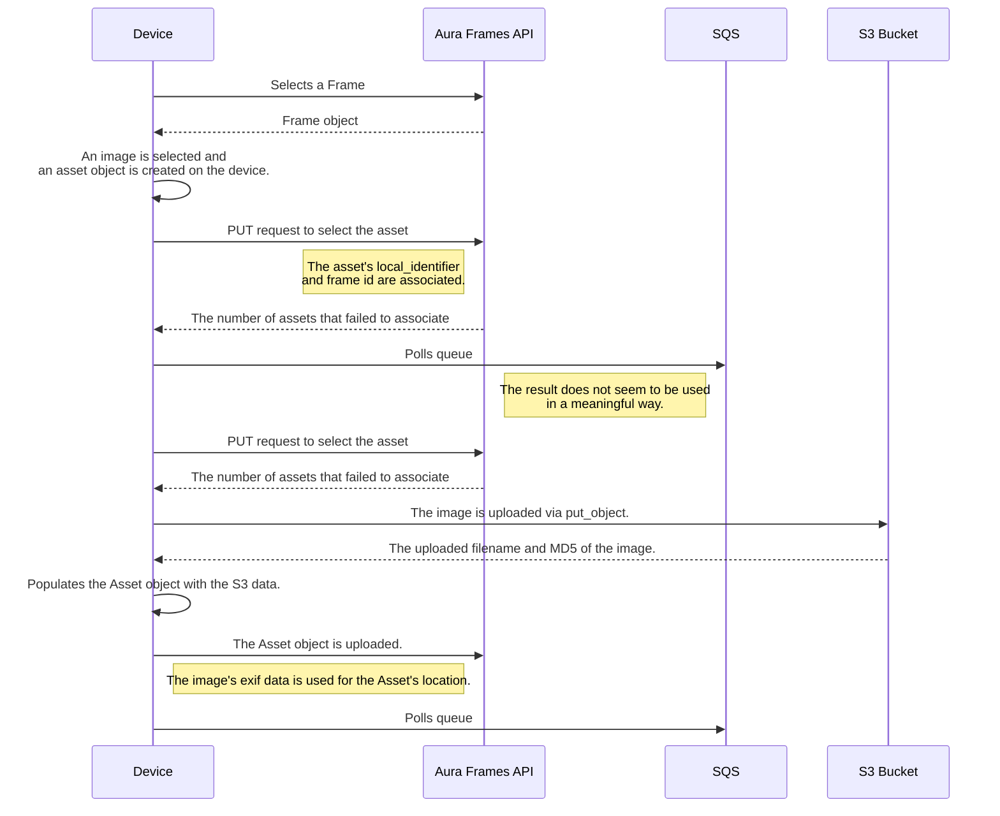

# How pushframe works — internals

This page is for readers who want to understand **how** the tool does what it
does: what the reverse-engineered API looks like, how the Google Photos mirror
engine is built, what the anti-abuse research found, and what remains unknown.
If you just want to use pushframe, the [README](../README.md) and the
[command reference](CLI.md) are all you need.

> Everything below describes an **unofficial, reverse-engineered** integration.
> The API is undocumented and can change without notice. Behaviors marked
> *live-verified* were exercised against a real account at the date given;
> that is a snapshot, not a guarantee.

## The cloud API (no local network)

pushframe talks to Aura's **cloud** (`api.pushd.com/v5`) plus AWS S3/SQS. It
never talks to the frame over your LAN — the frame is managed purely through
the account. The main building blocks:

- **Login** exchanges email + password for a session token (each login is
  itself rate-limit-guarded server-side: an explicit HTTP 475 lockout shape).
- **Frames** (`/frames`, `/frames/<id>.json`) list frames and their metadata.
- **Assets** (`/frames/<id>/assets.json`) paginate a frame's photos, including
  hidden ones and placeholder rows (see below).
- **Writes** go through two native batch endpoints —
  `/frames/<id>/select_asset.json` (associate uploaded bytes with the frame)
  and `/assets/batch_update.json` (finalize metadata) — plus S3 `put_object`
  into the image bucket, and `exclude_asset` / `remove_asset` /
  `delete_asset` for hide / frame-remove / account-wide destroy.
- **md5 is the content identity.** Uploads send the file's md5; diffs match on
  it. Hidden assets still count as present, which is what makes hide/re-show
  cycles free.

## The Google Photos mirror engine

`google-sync` mirrors an album onto a frame. The engine has three pieces:

1. **Album enumeration** — after the one-time cookie harvest (`google-link`),
   every call is plain authenticated HTTP over Google's internal
   `batchexecute` API. The album is walked **completely** (continuation RPC,
   300 items/page) until the listing exhausts cleanly; each item's exact byte
   size is measured with 1-byte `Range` requests.
2. **Staging cache** — photos download once into
   `~/.config/pushframe/google-cache/<album>/` (Google-side downloads run
   concurrently, bounded pool), are uploaded with the frame's md5 convention,
   and the cache is **pruned** once the uploads confirm.
3. **Persistent manifest** — `~/.config/pushframe/google-manifest.json`
   (mode `0600`, or per-pair under `~/.config/pushframe/pairs/<name>/` for
   named pairs) maps each Google photo id to its md5. The plan is rebuilt from
   the **album listing + manifest**, never from a walk of the pruned cache —
   that is what makes disk minimisation safe: "already synced" and "removed
   from the album" stay distinguishable.

A steady-state run therefore costs two listings and transfers nothing. The
diff is computed by md5 on both sides, so dedupe works **across accounts**: a
photo whose bytes are already on the frame (uploaded from anywhere, under any
name) is re-shown, never re-uploaded.

### The safety gates

- An **empty or truncated album listing aborts** instead of producing a plan —
  an empty listing cannot be distinguished from a truncated one, and either
  misread would "hide everything on the frame".
- The **mass-hide gate**: a plan hiding more than a fraction of the frame's
  photos (20 % by default, `PUSHFRAME_GOOGLE_SYNC_REMOVAL_THRESHOLD`)
  demands an explicit confirmation interactively; a **scheduled** run skips
  and logs instead of proceeding.
- **Hide-only removals** on this verb: the irreversible tiers (`--delete`,
  `--hard-delete`) exist only on the local-directory `sync`.
- **Failed downloads are never uploaded** — a partial or failed download is
  reported, retried next run, and never staged as junk bytes.

## The write path and the anti-abuse layer

Key findings from live runs and decompiling the official Android app
(*live-verified, 2026-09/10*):

- **Writes intermittently return a bare `401` and succeed on retry** —
  observed on roughly 4 in 10 runs, independent of endpoint, credentials, or
  exit-IP country. It clears immediately, unlike the budget trip below.
- **The account has a rolling write-volume budget** (≈50 new assets observed
  before a trip). Exceeding it returns `401`/custom `475` with no
  `Retry-After`. The official app never trips it because it drip-feeds
  uploads through a background `JobScheduler` queue (gated on charging +
  WiFi).
- **The trip can be scoped by surface**: reads (login, frames) may keep
  working while writes are refused — and provoking it further can spread the
  refusal to `login.json` itself (the explicit 475 shape).
- **The trip is account-wide, not session-scoped**: re-login bypasses
  nothing, and every call that touches a tripped surface re-arms the clock.
  One documented counter-evidence: 8 deliberate probes spread over 7 hours,
  all refused, each one buying another wait.
- **Client identity is fingerprinted**: a years-stale user agent and the
  all-zeros device identifier shared by every install read as "not a phone".
  Each install should set its own `DEVICE_IDENTIFIER` (`pushframe config set
  DEVICE_IDENTIFIER "$(uuidgen)"`).
- **Batch volume matters**: a 1-item write may pass where a 50-item chunk is
  refused, hence `--batch-size` on the write verbs.

pushframe's answer on the client side: a **token-bucket write budget** plus a
**geo pre-flight guard** before every write, batched endpoints (whole chunks
per call instead of one call per asset), a **stop-on-first-refusal** policy
(no retry, no re-login against a trip), and resumable plans — only confirmed
writes are remembered, so the next run uploads the remainder exactly once.

## The device flows (documented from code, not verified)

The two flows below are transcribed from the 2023-era reverse engineering of
the official app. They describe what the *app* does, not a path this client
exercises (the CLI batches steps 4–9 across many assets per call).

### Upload flow

[Aura.upload_image](../pushframe/aura.py) implements this as closely as possible:

1. A frame is selected; its data is retrieved (`/frames/<frame_id>.json`).
2. An image on the device is selected for upload.
3. An Asset object is created; a GUID (`local_identifier`) is generated.
4. A POST to `/frames/<frame_id>/select_asset.json` with the asset's
   `local_identifier` allows relating the asset to the frame once uploaded.
5. SQS is polled (the result does not seem to be used meaningfully).
6. Another `select_asset.json` request is sent with the same information.
7. A `put_object` request uploads the image to the S3 bucket; the uploaded
   filename and md5 come back.
8. The asset object is populated with the S3 response.
9. A PUT to `/assets/batch_update.json` finalizes the asset.
   - The image's location EXIF appears to be what populates future asset
     requests; EXIF set manually on the object beforehand is not returned.
   - Height/width can be spoofed to skew rendering; only location EXIF is used.
10. SQS is polled again.

### Download/view flow

1. A frame is selected; its data is retrieved (`/frames/<frame_id>.json`).
2. A paginated asset list is retrieved (`/frames/{frame_id}/assets.json`).
3. A URL is built from the image proxy URL, the uploader's user id, and the
   asset's S3 filename (see [export.py](../pushframe/export.py)).
4. The image is retrieved from that URL.

## Open questions

Reverse-engineering notes that remain unresolved:

- Map out the actual SQS flow (constant polling? push notifications?).
- Is it possible to have 2 active logins for the same account?
- Can one asset be associated with multiple frames? The device flow uploads
  per frame; a backend dedupe may exist. Worth checking whether the asset's
  S3 filename changes.
- Reverse the frame's actual rendering process (MITM proxy before
  considering JTAG/firmware dumping).

## Verification history

What was verified, when, and against what: [VERIFICATION-REPORT.md](../VERIFICATION-REPORT.md)
(read path, per-step status and live API drift repaired) and the
[command reference](CLI.md)'s per-command evidence. The changelog records
every release-level fix with its trigger.
